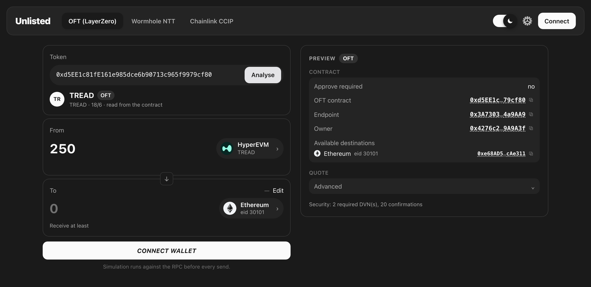

<h1 align="center">Unlisted</h1>

<p align="center">
  <b>Bridge any LayerZero OFT token — even the ones no bridge UI has listed.</b><br>
  Paste the contract, pick a chain and an amount. Unlisted reads everything else from the contract itself.
</p>

<p align="center">
  <a href="https://oft-bridge-ui.pages.dev"><b>oft-bridge-ui.pages.dev</b></a>
</p>

<p align="center">
  
</p>

---

## Why

Hundreds of tokens ship a LayerZero **OFT** bridge, but only a handful appear in Stargate or other bridge front-ends. For the rest, users are left calling `send()` by hand on a block explorer — eleven fields, 18-decimal amounts, and one typo away from losing funds.

Unlisted is the missing form. It is a static page: no backend, no database, no contracts of its own, nothing custodied. It reads the OFT contract, builds the exact `send` transaction, shows you every field, and hands it to your wallet.

## How it works

1. **Connect** a browser wallet and choose the source chain: MetaMask, Rabby, … for EVM chains; Phantom, Solflare, Backpack, … when the source is Solana.
2. **Paste** anything that identifies the token: the OFT / OFTAdapter contract address (on Solana: the OFT Store address), the hash of any past bridge transaction on any supported chain, a Solana signature, or a LayerZero Scan link. Transactions are read from their **logs**, so a bridge that went through a router, an aggregator or a smart wallet is still resolved to the contract underneath — and a transaction sent on a different network is found there and offered with a "switch" button.
3. **Choose** a destination (only chains the contract actually has a peer on) and an amount.
4. **Review.** The quote, the fee, the recipient and the raw `amountLD` / `minAmountLD` are shown exactly as they will be sent, in a panel that stays in view. Twenty checks run, including a live simulation whose reverts are decoded into named errors (`NoPeer`, `SlippageExceeded`, `ERC20InsufficientAllowance`, `EnforcedPause`, …) with what to do about each.
5. **Send.** Delivery is tracked through LayerZero Scan until the tokens land on the other side.

## Supported networks

| Network | LayerZero eid | | Network | LayerZero eid |
|---|---|---|---|---|
| Ethereum | 30101 | | Polygon | 30109 |
| Arbitrum | 30110 | | Avalanche | 30106 |
| Optimism | 30111 | | HyperEVM | 30367 |
| Base | 30184 | | Linea | 30183 |
| BNB Chain | 30102 | | Scroll | 30214 |
| Solana | 30168 | | | |

Any OFT (LayerZero V2) deployed on these chains works, in both directions between EVM and Solana:

- **EVM → Solana** — the Solana side is discovered from `peers(30168)` (program, mint, token program, PeerConfig); the recipient must be a Solana wallet typed by hand (never your EVM address); executor options are derived from the contract's enforced options plus token-account rent when the recipient has none.
- **Solana → EVM** — paste the token's **OFT Store** address (or the signature of any past `send`); its program, mint, escrow and per-chain PeerConfigs are read from the chain. The `send` instruction is built with LayerZero's own Solana SDK, then decoded back by independent code before your wallet sees it (same self-check as on EVM). The recipient is an EVM address typed by hand; your Solana wallet is never offered as one. The fee is the quoted LayerZero fee plus a buffer: the program takes only the quoted amount, the rest never leaves your wallet.

Adding a chain is one entry in [`src/core/chains.ts`](src/core/chains.ts).

## Wormhole NTT

The **NTT** tab bridges Wormhole Native Token Transfers between EVM chains. The manager contract is
the approve spender, so it has to earn that: `verifyNttManager` refuses unless all four of these
hold, and a check that cannot be completed counts as a refusal.

1. The token is in [Wormhole's official NTT token list](https://api.wormholescan.io/api/v1/native-token-transfer/token-list)
   for this network, and the manager names exactly that address.
2. **The token vouches for the manager.** On at least one side of the pair the listed token names it
   as its minter — `minter()`, or `hasRole(MINTER_ROLE, manager)` with the role read from the token.
   A locking hub mints nothing, so it is confirmed through the burning side of the pair.
3. Peers point at each other in both directions, the destination side read on its own RPC.
4. A Wormhole transceiver that reports the Wormhole type, points at this network's official core
   bridge, and has automatic relaying enabled — a route that would need a manual redeem is refused.

Wormholescan's decoded transfers are shown as context but are never evidence: `sourceNttManager` is
written by the manager itself, so a single self-made transfer would launder a fake. Only the token
can vouch for the manager.

Two more things the contracts decide, not us: an approve is needed in **both** modes, because the
manager pulls with `transferFrom` before it burns or locks; and the amount is rounded **down** to
the precision the route carries, because the manager reverts on dust instead of trimming.
`shouldQueue` is always false — over a rate limit the transfer must revert, not sit in a queue.

## Chainlink CCIP

The **CCIP** tab bridges tokens between EVM chains through Chainlink's router. Two addresses decide
everything and both come from configuration, never from anything read on chain or typed in:

- the **Router** — which is also the approve spender, and
- the **TokenAdminRegistry**, which names the pool for a token.

Both are taken from the [CCIP Directory](https://docs.chain.link/ccip/directory/mainnet), through
its own machine-readable data file, with the chain selectors from `smartcontractkit/chain-selectors`.
The pool is only ever used to learn where a token can go and what its rate limits are; a pool wired
to some other router is refused, because nothing sent through the official router would reach it.

The message is the one Chainlink's own tutorial builds for a token transfer to an EOA: the receiver
abi-encoded, empty `data`, one token entry, the native coin as the fee token, and
`EVMExtraArgsV2(gasLimit: 0, allowOutOfOrderExecution: true)`. A guard re-checks that shape, and the
self-check decodes the calldata back before it is signed — a payload smuggled into `data` would turn
a transfer into a call on the other side.

`msg.value` is **exactly** the quoted fee, with no buffer, because `Router.ccipSend` says
*"we take the whole msg.value regardless if its larger"* — an over-payment would be kept, not
refunded. Both pool rate limits are read, the inbound one on the destination's own RPC, and the
amount that arrives is computed from the destination token's decimals rather than assumed.

### It also says when the answer is no

If the transaction belongs to a bridge this app does not build — Wormhole NTT, Chainlink CCIP, Wormhole Portal, Axelar, Circle CCTP, Hyperlane, or a network's own bridge — it is named, and you are pointed at that project's own app instead of being told "not an OFT". A LayerZero application that is not an OFT is called out as exactly that. A transaction nobody's RPC could be reached for is reported as an RPC problem, never as a verdict.

Every event signature, error signature, chain id and selector used for this comes from the protocol's own contracts; topic hashes are derived from those signatures by the library, never written down by hand ([`src/core/analysis/`](src/core/analysis/), [`src/core/lz/`](src/core/lz/), [`src/protocols/`](src/protocols/)).

## Security model

**It cannot take your funds.** The app is a static site that only ever asks your wallet to sign five things: an ERC-20 `approve` (for exactly the amount being bridged, never unlimited), the OFT `send`, the NttManager `transfer`, the CCIP Router's `ccipSend`, and — from Solana — the OFT program's `send` instruction. No `eth_sign`, no typed-data, no permits, no message signing, no SPL approvals or transfers, no arbitrary calldata or hand-built instructions. A build-time check ([`scripts/check-whitelist.mjs`](scripts/check-whitelist.mjs)) fails the build if anything else appears in the code: it confines the Solana SDK and the single submit call to one file, allows `transfer` and `ccipSend` only inside their own protocol modules and the one screen each that submits them, and refuses to let the shared ERC-20 ABI ever declare a `transfer` of its own — so no code path here can move tokens with a plain ERC-20 transfer.

**What goes to the wallet is what you see.** Before signing, the calldata (EVM) or the whole transaction (Solana: one signer, compute budget, the nine fixed `send` accounts, the instruction data) is decoded back and compared field-by-field with the plan on screen. `msg.value` always equals the quoted LayerZero fee (plus a buffer the contract refunds; on Solana the program simply takes only the quoted fee).

**It checks the bridge, not just the form.**
- The destination-side peer must name your contract back — a look-alike adapter can point at the real token, but the real bridge will never point at the fake.
- Contract facts are read from two independent RPC providers; if they disagree, nothing is sent.
- Options copied from a sample transaction are stripped down to a receive-gas hint; `nativeDrop` and `compose` payloads (a way to route your fee to a stranger) are dropped and shown in red.
- For lock/unlock adapters the app shows how much the adapter holds and flags an empty one.
- Slippage is capped at 5%. Sending to an address other than your own wallet requires an explicit switch and re-typing the address's last characters.

**Nothing leaves your browser** except calls to the chain's RPC, the transaction hash to LayerZero Scan for tracking, and — in the NTT tab — Wormhole's own explorer for the official token list and delivery status. No analytics, no telemetry, no third-party scripts or fonts; a strict Content-Security-Policy enforces it. Recent transfers live in your browser's local storage only.

**Auditable.** The footer shows the commit the site was built from and links to it here. Dependencies are pinned to exact versions and audited in CI; the few advisories that do not apply (native-addon or server-only code that never reaches the browser bundle, which CI verifies) are listed with reasons and expiry dates in [`audit-exceptions.json`](audit-exceptions.json). The Solana stack (LayerZero SDK, umi, wallet adapter) is downloaded only when Solana is chosen as the source; a few helper packages the SDK declares but never needs are replaced by tiny stand-ins at build time (see [`shims/`](shims/README.md)) so that no mnemonic or key-derivation code is ever shipped.

### What it cannot do

- Tell a real token from a fake one with the same name. For a plain OFT your balance under the contract is the proof — the contract *is* the token. For an OFTAdapter your balance belongs to the token, not the bridge: take adapter addresses from the project's official sources.
- Guarantee delivery. Rate limits, paused destinations or missing executor gas are the contract's and LayerZero's domain. The app warns where it can and links to LayerZero Scan.
- Undo anything. Cross-chain transfers are irreversible; try a small amount first.

## Development

```sh
npm ci
npm run dev             # http://localhost:3000
npm test                # write-whitelist check + unit tests
npm run audit           # npm audit against the reviewed exception list
npm run build           # static export to out/ + security headers
npm start               # serve out/ with the same headers as production
```

`npm run test:integration` runs read-only tests against public RPCs and, if [Foundry](https://getfoundry.sh) is installed, fork tests that execute real `approve`/`send` transactions on a local anvil fork.

Build-time configuration lives in [`.env.production`](.env.production) (all values public):

| var | purpose |
|---|---|
| `NEXT_PUBLIC_CANONICAL_DOMAIN` | shown in the footer so users can spot phishing clones |
| `NEXT_PUBLIC_REPO_URL` | source link in the footer |
| `NEXT_PUBLIC_WC_PROJECT_ID` | enables WalletConnect (mobile wallets via QR); off by default |
| `CSP_CONNECT_EXTRA` | extra `connect-src` hosts for the generated CSP (e.g. your own RPC) |

### Layout

```
src/app      one static page per protocol tab (/oft, /ntt, /ccip); / redirects to the last one used
src/core     pure logic, no React: abi, chains, protocols, amounts, plan, guards, probe, options, quorum, track
src/core/svm Solana: base58, PDAs, account layouts, discovery, the send plan codec/self-check, the SDK boundary (send.ts)
src/ui       wagmi/RainbowKit providers, the shell (header/tabs/history), the Solana wallet slot, hooks, components, local storage
shims        build-time stand-ins for LayerZero helper packages the Solana SDK declares but never uses
scripts      build, security headers, write-whitelist check, local server
tests/core   unit tests · tests/integration  live-RPC and anvil fork tests
```

The interface is desktop-only by design: a ~1280px two-column layout (form left, live preview right)
with a 1024px floor — below that the page scrolls sideways rather than reflowing. Switching tabs
changes the URL without reloading, so the wallet, the RPC settings and an in-flight transfer survive.

Everything that touches money lives in `src/core` and is covered by tests.

## Deploy

The build is a folder of static files. On Cloudflare Pages: connect the repo, build command `npm run build`, output directory `out`, `NODE_VERSION=24`. Security headers are emitted to `out/_headers` on every build and applied automatically. Other static hosts: use `out/csp.txt`.

### Site password

[`functions/_middleware.js`](functions/_middleware.js) puts one shared password in front of the whole site (HTTP Basic Auth, checked at Cloudflare's edge). Set it in the Pages project: **Settings → Environment variables → `SITE_PASSWORD`** (mark it *Encrypt*, add it for both Production and Preview), then redeploy. Without the variable the site answers `503` rather than serving anything. Change the variable to rotate the password; the old one stops working on the next request. The middleware only affects Cloudflare Pages — `npm start` serves the plain files.

## License

MIT
